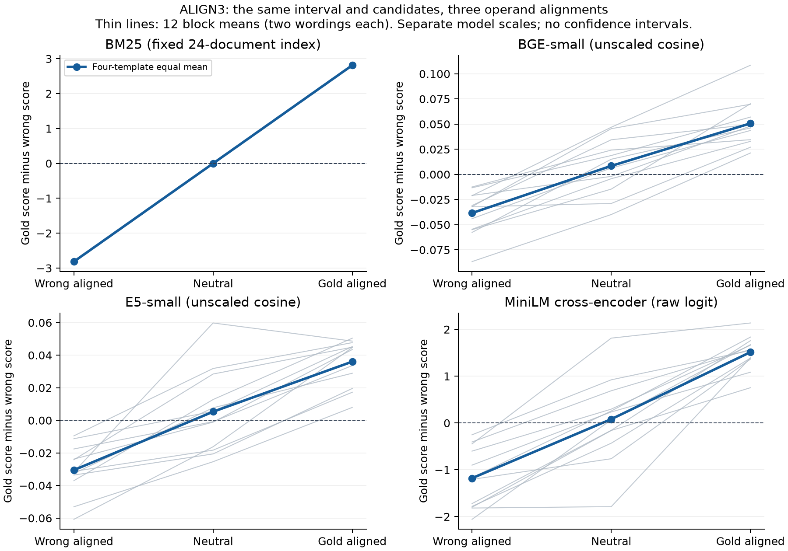

# FactGap — ALIGN3 research artifacts

This archive accompanies **FactGap: A Controlled Paired-Ranking Diagnostic for Equivalent Query Reformulations**, by **Haoting Qiu and Qibai Chen**, in that order. It contains the exact supplied eight-page manuscript and the archival evidence used by its ten tables and two figures. Repository: [https://github.com/hyauu/FactGapV2](https://github.com/hyauu/FactGapV2). No DOI, submission, acceptance, or novelty approval is claimed.

## Start here

- [Eight-page ALIGN3 manuscript](paper/FactGap_CAIT2026_ALIGN3_8page.pdf)
- [Table and figure provenance map](provenance/MANUSCRIPT_ARTIFACT_MAP.csv)
- [Offline replay](#run-offline-replay)
- [Evidence and scope](#separate-evidence-cohorts)
- [Preparation and verification receipt](provenance/GITHUB_PREPARATION.json)

## Research question

Does a ranker prefer a different candidate when an arithmetic operand matches a candidate numeral, although the resulting interval and the candidate passages stay fixed?

A scored example from `eval_block_00`, wording 1, illustrates the three conditions. All queries ask about the spruce batch with an item count **below 363 + 31**, and **at least** the following subtraction. Candidates are count **394** and count **353**. Every subtraction evaluates to 328, so the same interval `[328,394)` accepts 353 and excludes 394.

| Condition | Lower-bound expression | Leading operand |
| --- | --- | --- |
| WRONG_ALIGNED | 394 minus 66 | Matches invalid candidate |
| NEUTRAL | 344 minus 16 | Matches neither candidate |
| GOLD_ALIGNED | 353 minus 25 | Matches valid candidate |

The complete scored text is in `data/align3/data/eval_queries.jsonl`; evaluation labels and draw metadata are separate in `data/align3/private/`. Labels are retained for evaluation replay and were not supplied to rankers.



## Separate evidence cohorts

| Cohort | Material | Interpretation |
| --- | --- | --- |
| ALIGN3 | 72 queries, 12 numerical blocks, four shared templates | Main locked exploratory alignment control; four local scorers |
| Original corrected | 147 items: 80 temporal and 67 unit, 22 families, four query forms | Original corrected confirmatory outcome remains INCONCLUSIVE, 0 of 7 endpoints supported |
| Boundary expression | 48 queries, 12 blocks, four templates | Earlier two-condition local comparison, not pooled with ALIGN3 |
| Hosted boundary | Same 48 boundary queries, three archived provider configurations | 432 logical requests, 436 archived attempts; no hosted scores for ALIGN3 |
| Parser feasibility | 32 main queries, eight blocks, four related templates; 12 separate probes | Zero main query coverage; activated repair efficacy and safety remain unmeasured |

Broader 336-query development and its post-score property clarifications are retained under the separate `broader_development` provenance/data/results directories. They are outside all five paper evaluation denominators.

## Run offline replay

Use Python 3.12 with the packages recorded in `requirements-replay.txt` already installed. No model weights, API credentials, GPU, or parent project files are needed. From this extracted directory:

```console
python scripts/replay_all.py --output replay_output
python scripts/verify_manuscript_artifacts.py --output manuscript_check
python scripts/check_archival_tests.py --output archival_tests
python scripts/scan_release.py --output release_scan.json
```

Place output directories **outside** this immutable candidate when preserving the original release seal. For example, replace `replay_output` with `../replay_output`. The replay command denies Python socket calls, removes API credential environment entries from its process, checks release hashes, reconstructs results from stored raw records, and compares them with archived outputs. It does not invoke rankers, providers, tokenizers, or new reviews. This process guard is not an OS-wide network sandbox.

The original primary replay regenerates the already locked 50,000 bootstrap draws with the recorded seed and verifies 21 stored arrays. This is deterministic reproduction of the original analysis, not new hypothesis selection. Parser replay recomputes 352 deterministic decisions and preserves recorded timing fields; those timings are not new performance measurements.

Historical analysis code is preserved under `src/`. Run the documented `scripts/` entry points for portable replay. They restore relative cohort layouts in their output directory and explicitly adapt only historical path/hash checks. `provenance/SOURCE_TO_RELEASE_MAP.json` records each original and derivative hash. Full original locks were checked at export; lock entries outside the whitelist cannot be rechecked from this reduced public candidate. This limitation is recorded per cohort in replay receipts.

## Locate each paper display

See `provenance/MANUSCRIPT_ARTIFACT_MAP.csv` and `provenance/MANUSCRIPT_VERIFICATION.json` for exact released paths, original SHA-256 values, derivative SHA-256 values, and checks. The map has all twelve LaTeX display labels. Figures were checked using their actual vector paths, including all 48 block curves in Figure 1 and all 20 points in Figure 2. Table VIII uses full-precision contrasts, not subtraction of rounded display values.

The PDF and every selected paper source/asset are byte-identical to the supplied eight-page manuscript. `paper/build.sh` and `paper/build.bat` are the unchanged authors' build entry points; building requires an existing LaTeX installation with IEEEtran and the manuscript's packages. No paper recompilation was performed for this export. Historical handoff/editing snapshots and their logs were intentionally omitted.

## Interpretation limits

Four template families are reused between development and evaluation. Neither 24 queries per condition nor cached reversed candidate orders are independent constructs. ALIGN3 changes compensating operands and token composition; it does not isolate a single exact-match mechanism for neural models. E5's non-monotonic block is retained. Neural score scales are interpreted within their own model and cohort. BM25 has a distinct fixed corpus in each study.

Automated QA uses operationally separated contexts with shared backends and incomplete tool/isolation traces. It does not establish independent human annotation. Original accepted-item selection has incomplete rejection provenance. Duplicate distractors remain in all 67 original unit hard corpora. Hosted alias matches do not establish immutable provider snapshots. Parser zero coverage measures inactivity under the tested wording, not successful safe correction.

## Rights and distribution

Code is licensed under **MIT**; author-owned synthetic data and figures under **CC BY 4.0**; the paper retains copyright. Third-party rights remain applicable. See [LICENSING.md](LICENSING.md), [THIRD_PARTY_NOTICES.md](THIRD_PARTY_NOTICES.md), and [AI_DISCLOSURE.md](AI_DISCLOSURE.md).

The latest user instruction is an **public repository**. This edition adds packaging, licensing, and documentation only. It introduces no experiments, reviews, new scoring, or manuscript edits. Paper submission is not part of this upload.
