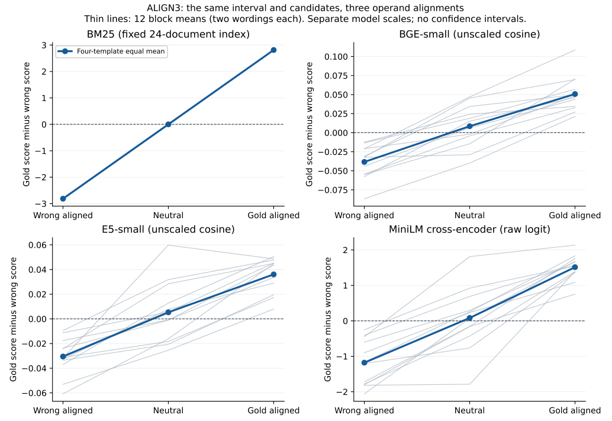
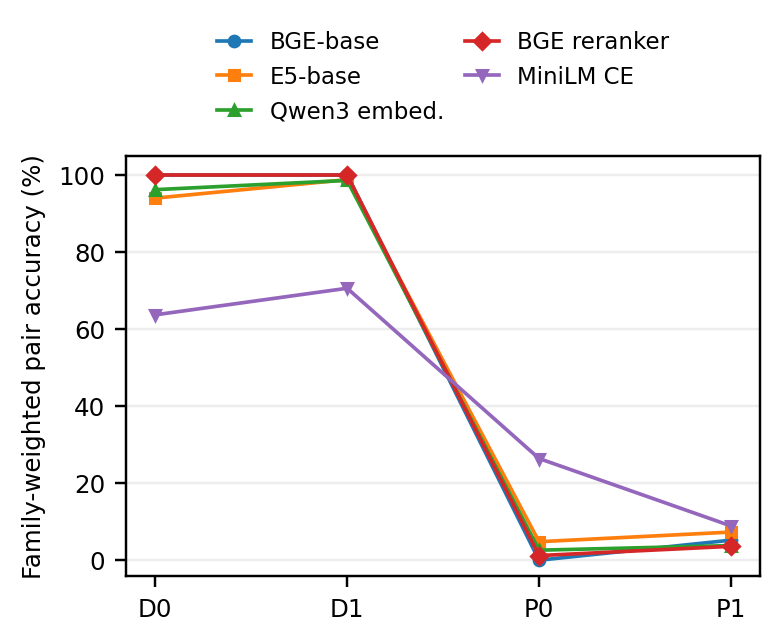

# FactGap: A Controlled Paired-Ranking Diagnostic for Equivalent Query Reformulations

**Haoting Qiu**  
Independent Researcher, United States  
qiu.haot@northeastern.edu

**Qibai Chen**  
Independent Researcher, United States  
qibaic@alumni.cmu.edu

## Abstract

Which candidate numeral appears in a query can change document ranking even when the constraint is unchanged. FactGap examines this relation with a three-condition operand-alignment control. Each query specifies a half-open interval through arithmetic expressions. The interval, candidate passages, operation structure, character count, and word count remain fixed; a leading operand matches the invalid candidate, neither candidate, or the valid candidate. A compensating operand preserves the boundary value. Across 72 queries from 12 blocks and four templates, all four local configurations have increasing mean valid-minus-invalid margins in that order. BGE-small, E5-small, and MiniLM win 1/24, 0/24, and 3/24 comparisons under wrong alignment, respectively, and 24/24 each under correct alignment. BM25 moves from all losses through all ties to all wins. Neural neutral-condition rankings vary, and one E5 block departs from strict margin ordering. Earlier temporal/unit and boundary-expression studies motivate this control; the original confirmatory outcome remains inconclusive. Three hosted configurations solve the separate, earlier 48-query boundary set in both expression forms. The exploratory results link ranking preference to operand alignment under matched sentence structure, with accompanying operand and subword changes limiting neural mechanistic interpretation.

information retrieval, query reformulation, paired ranking, numerical constraints, retrieval robustness

## Introduction

A number repeated in a query need not be a relevant answer. It may be an excluded endpoint or an operand used to specify a different value. Consider records with counts 214 and 231, and a query requiring a count in $[197,231)$. The lower boundary can be written as $231-34$, $222-25$, or $214-17$. All three expressions equal 197, yet their leading operands match the invalid record, neither record, or the valid record. With the upper boundary held fixed, the correct choice remains 214. This example motivates our question: how does candidate-numeral alignment within an equivalent constraint affect ranking?

Query variation and surface preferences are established problems in retrieval \[1, 2, 3\]. Numerical queries make the distinction between overlap and relevance testable through exact constraints. A matched numeral can favor the wrong passage even when the rest of that passage differs from the satisfying one only in its recorded value. The task is then to discriminate between a passage that satisfies the whole constraint and a closely matched counterpart.

We study this relation through *three-condition operand alignment* (ALIGN3). Every condition contains arithmetic. A leading operand matches the invalid value (WRONG), neither value (NEUTRAL), or the valid value (GOLD); its compensating operand changes to keep the interval unchanged. The sentence frame, operation positions, numeral-span widths, character count, and word count are fixed within each comparison. This controls the structural differences in an earlier literal-versus-arithmetic study, while retaining measurable changes in the operand pair and numerical subwords.

The control yields a directional result. All four tested local configurations have increasing mean margins from WRONG through NEUTRAL to GOLD. BM25 changes from incorrect preference to indifference and then correct preference. BGE-small, E5-small, and MiniLM differ in the neutral condition, and E5 has one non-monotonic block. We report the individual-block behavior alongside aggregate counts rather than treating query variants as independent constructions.

An earlier 147-item temporal and unit study motivated this closer examination. Its corrected descriptive results vary by construction, and its prespecified cross-type analysis remains inconclusive. A subsequent 48-query boundary experiment improves several local rankers by replacing a directly written endpoint with an equal-valued expression. ALIGN3 examines the direction of this sensitivity with arithmetic in all three conditions. The earlier studies and their unchanged analysis are retained in Section VI and Appendix A.

We contribute the three-level paired control and document its ranking responses at query, block, and template levels. Two supplementary tests locate its scope: three hosted models solve the earlier boundary set, while a limited parser fails to activate on new wording. The main design and results follow in Sections IV–V; the scope tests concern separate interfaces and implementations.

## Related Work

### Equivalent queries and retrieval robustness

Hagen et al. examine query-variation robustness in transformer-based retrieval, and Campese et al. train retrievers for more coherent rankings across semantically equivalent queries \[1, 2\]. Cao et al. study how formality, grammatical correctness, and other linguistic dimensions affect retrieval and generation \[4\]. FactGap focuses on a fixed satisfying/counterpart pair whose relevance depends on a numerical or temporal constraint preserved across queries.

### Minimal contrasts and lexical preferences

NevIR tests retrieval distinctions through negation-sensitive relevance contrasts \[5\]. Fayyaz et al. report preferences for document length, position, repetition, and literal matching; Hagström et al. examine weaknesses associated with lexical similarity in language-model re-rankers \[3, 6\]. Our counterpart construction examines a related conflict: the query repeats a numeral in a passage that its own constraint excludes.

### Quantities, implicit facts, and rewriting

Almasian et al. incorporate quantity information into ranking under equality and comparison conditions. DeepQuant represents quantities, compatible units, and comparison intent in dense retrieval \[7, 8\]. ImpliRet places temporal, arithmetic, and other implicit information in documents while keeping queries simple \[9\]; here, reformulation occurs on the query side.

Goyal et al. find that query enhancement interacts with retriever biases differently across methods and retrievers \[10\]. Our boundary studies examine one reason canonicalization may change ranking: making a numeral explicit can restore a literal match to an incorrect passage. The parser in Appendix D is a limited feasibility baseline, separate from these quantity-aware methods.

## Paired-Ranking Task

### Complete constraints and score margins

For item $i$, let $q_{i,c}$ be the query in condition $c$, $d_i^+$ the satisfying passage, and $d_i^-$ its critical counterpart. A typed predicate records subject, property, value or interval, unit, and temporal scope as applicable. Every equivalent query form must satisfy $$P_i(d_i^+)=1,\qquad P_i(d_i^-)=0.$$ The rendered query and passages are checked alongside the symbolic predicate: a correct number on the wrong property is insufficient. The pair margin for scorer $s$ is $$m_{i,c}=s(q_{i,c},d_i^+)-s(q_{i,c},d_i^-).$$ Margins retain each scorer’s scale. Follow-up local studies use $m>0$ as strict success, with exact ties separate from wins and losses and near-tie bands at $10^{-6}$ and $10^{-5}$. The original temporal/unit study retains its locked $10^{-8}$ tolerance. Each pair supplies the satisfying passage, so this measures pair discrimination rather than corpus recall, top-$K$ retrieval, end-to-end answer accuracy, or the historical truth of conflicting records.

### Evidence cohorts

Table II distinguishes the main control from the earlier and supplementary studies. Wording variants, candidate-order reversals, cached scores, and repeated evaluation by different models do not create additional construction units. Hosted evaluation reuses the 48-query boundary set. The parser’s 12 safety probes include cases without a unique satisfying passage and are excluded from accuracy denominators.

## Three-Condition Operand Alignment

### Equivalent intervals and a fixed candidate pair

The control holds the interval and both candidate records fixed. One recorded value lies strictly inside a half-open interval; the other is an excluded endpoint. A designated operand in one boundary expression matches the invalid candidate (WRONG), neither candidate (NEUTRAL), or the valid candidate (GOLD). Its compensating operand changes at the same time to preserve the boundary.

For the illustrative interval $[197,231)$ with candidate counts 214 and 231, the lower-bound expressions are $$\underbrace{231-34}_{\mathrm{WRONG}}=
\underbrace{222-25}_{\mathrm{NEUTRAL}}=
\underbrace{214-17}_{\mathrm{GOLD}}=197.$$ The upper bound remains $216+15=231$. Both boundaries are represented arithmetically in every condition: one addition and one subtraction. The satisfying value remains 214. The example illustrates the construction rather than quoting a scored query verbatim.

Within each block and wording, candidate texts, entity, count property, and inclusion flags stay fixed. So do the sentence frame, comparison words, operation positions, numeral-span widths, character count, and space-delimited word count. Alignment is equality of a complete decimal numeral span, not a shared digit substring. Compensating values, carry/borrow patterns, and digit/subword composition change with the operand pair. Actual tokenizer lengths differ by at most one token.

**Figure 1.** ALIGN3: ranking preference across operand alignments with the interval and candidates fixed. Thin lines are the 12 block means after averaging two wordings; the thick line equally averages four templates, each containing three blocks. Positive margins favor the valid candidate. Score scales differ by model. The non-monotonic E5 block is retained.

### Construction and review

Development review covers four blocks and 24 queries. Evaluation has 12 new numerical blocks, with three instances in each of the same four templates. Three alignment conditions and two wording orders per condition yield 72 queries, or 24 per condition. Six blocks use $[L,U)$ and six use $(L,U]$. Evaluation introduces new entities, values, and text instances but shares the reviewed template inventory with development.

Semantic and design review precede the evaluation and scoring lock. Initial reviewers receive anonymous query/candidate packets in separate contexts, without gold labels or sibling expressions; complete-block design review follows answer sealing. Rendered-text judgments are compared with the generator metadata. The review provides operationally blinded automated QA, with shared model backends, incomplete tool traces, and no enforced file isolation. It is separate from independent human annotation.

### Local scoring and analysis

We score with BM25, BGE-small-en-v1.5, E5-small-v2, and MS MARCO MiniLM-L6-v2. BGE uses its retrieval query prefix, CLS pooling, and L2 normalization. E5 uses query/passage prefixes, masked mean pooling, and L2 normalization. MiniLM returns its raw single-output logit. Neural scoring uses FP32 without silent truncation. These small BGE/E5 checkpoints differ from the base-sized checkpoints of the original study.

BM25 uses one fixed index of exactly 24 distinct candidate texts, with no auxiliary passages, $k_1=1.2$, $b=0.75$, and positive IDF. Both candidate orders are recorded. Local query–document scorers evaluate each pair independently; reversed display order reuses identical scoring inputs through an explicitly recorded cache. Reuse checks order consistency rather than adding another independent forward pass.

The primary outcome is the valid-minus-invalid score margin. We average two wordings within each block, three blocks within each template, and then four templates equally. Wins, losses, and exact ties complement these margins. Appendix B retains all aggregate margins and paired shifts. Block and leave-one-template-out summaries describe the observed constructions; no significance tests or population intervals are added.

## Ranking Preference Follows Alignment

### Wrong, neutral, and correct alignment

Mean margins increase from WRONG through NEUTRAL to GOLD for all four configurations (Fig. 1). Under wrong alignment, the three neural rankers win only 0–3 of 24 comparisons each; under correct alignment, each wins 24/24. The neutral condition separates their behavior: BGE-small wins 15/24, E5-small 14/24, and MiniLM 13/24 (Table I).

**Table I.** Operand-alignment outcomes out of 24 queries per condition. W/L/T: wins/losses/exact ties. Strict blocks have increasing mean margins across all three conditions.

| Configuration | WRONG | NEUTRAL | GOLD | Strict blocks |
|:--------------|-------------------------------------:|---------------------------------------:|------------------------------------:|--------------:|
| BM25          |                               0/24/0 |                                 0/0/24 |                              24/0/0 |         12/12 |
| BGE-small     |                               1/23/0 |                                 15/9/0 |                              24/0/0 |         12/12 |
| E5-small      |                               0/24/0 |                                14/10/0 |                              24/0/0 |         11/12 |
| MiniLM CE     |                               3/21/0 |                                13/11/0 |                              24/0/0 |         12/12 |

BM25 moves from 24 losses through 24 exact ties to 24 wins. Neutral alignment removes its incorrect preference without distinguishing the candidates. Independent term-wise calculations reproduce its scores on all 72 queries. In these matched passages, exact candidate-numeral matches account for the negative–tie–positive pattern. Neural models follow the same average direction, but their neutral rankings contain both wins and losses.

### Block and template behavior

GOLD$-$WRONG and NEUTRAL$-$WRONG are positive in all 12 block means for every configuration. GOLD$-$NEUTRAL is positive in all blocks for BM25, BGE-small, and MiniLM, and in 11 of 12 blocks for E5-small. In the remaining E5 block, both conditions favor the valid candidate, but NEUTRAL has the larger margin: $+0.059769$ versus $+0.048645$, a difference of approximately 0.011124.

Each of the four template averages is positive for all three contrasts. GOLD$-$WRONG and NEUTRAL$-$WRONG remain positive under every leave-one-template-out average. Reversing candidate order changes no scores, and no neural margin lies within either near-tie band. E5’s exception and the mixed neutral rankings limit a uniformly ordered interpretation at the individual-block level.

**Table II.** Evidence cohorts. ALIGN3 is the main alignment control; the other cohorts retain their separate sampling and analysis.

| Study                  | Material                                                    | Evaluation and scope                                                                                                  |
|:-----------------------|:------------------------------------------------------------|:----------------------------------------------------------------------------------------------------------------------|
| Operand alignment      | 12 blocks; four DEV-shared templates; 72 queries            | BM25 and three local neural rankers; three conditions, two wordings; locked exploratory control                       |
| Original temporal/unit | 147 items; 22 families; four query forms                    | Three retrievers, controlled re-rankers, selected pipelines; corrected original analysis, INCONCLUSIVE, 0/7 supported |
| Boundary expression    | 12 blocks; four templates; 48 queries                       | Same four local configurations as ALIGN3; two conditions, 24 queries each; locked exploratory comparison              |
| Hosted behavior        | Same 48 boundary queries                                    | Three configurations; query-only extraction and two-order selection; cross-interface behavioral comparison            |
| Parser feasibility     | Eight blocks; four related templates; 32 queries; 12 probes | Original scoring, canonicalization, constraint checking; method locked before new material; zero query coverage       |

## Earlier Diagnostics and Design Motivation

### Temporal and unit reformulations

The original study contains 80 relative-temporal items in 12 families and 67 unit items in ten families. D0 states the target directly; D1 paraphrases D0; P0 expresses the equivalent constraint through temporal or unit normalization; P1 paraphrases P0. The oracle-canonicalized C0 equals D0 byte for byte in every accepted item and is a reference, not an additional measurement or evaluated repair. Table V gives shortened illustrations.

In all 80 temporal P0 items, the next-year anchor equals the counterpart’s year. Resolution demand and alignment to the wrong passage therefore change together. Among unit items, 54/67 use $\times1000$ conversions whose numeral strings preserve or extend digits from the satisfying value; the remaining 13 use hours-to-minutes conversion without that cue. Conversion factor and surface cues differ together.

The original retrievers are BGE-base-en-v1.5, E5-base-v2, and Qwen3-Embedding-0.6B. Controlled re-ranker analysis uses BGE-reranker-base and the MS MARCO MiniLM cross-encoder. Archived Qwen3-Reranker scores are nearly saturated and excluded from substantive interpretation. The original corrected accuracies average items within a family and then families equally within each type (Table VI); they are not raw counts divided by 80 or 67.

Temporal accuracy changes from 100.0% to 0.0% for BGE-base, 94.0% to 4.8% for E5-base, and 100.0% to 1.2% for BGE-reranker between D0 and P0 (Fig. 2). MiniLM’s D0 baseline is only 63.7%. Ordinary paraphrases generally retain the retrievers’ high direct-form performance, with variation across re-rankers and forms. BGE-base unit P0 accuracy is 100.0%, 85.7%, 95.2%, and 53.6% for kilometer-to-meter, kilogram-to-gram, liter-to-milliliter, and hours-to-minutes items. These groups contain 20, 14, 20, and 13 items across three, two, three, and two families, respectively.

The prespecified original cross-type outcome remains **INCONCLUSIVE, with 0/7 primary endpoints supported**. These descriptive changes did not satisfy its joint thresholds, validity, breadth, and eligibility requirements. Appendix A retains every endpoint, interval, and decision rule. The later controls are exploratory extensions; they leave this classification unchanged.

<figure id="fig:temporal">

<strong>Figure 2.</strong> Original corrected temporal accuracy, equally weighted across families. D0/D1 give the year directly; P0/P1 retain a counterpart-aligned anchor while requesting the following year. Full values for both types are in Table VI.

</figure>

### Literal versus arithmetic endpoints

The earlier boundary study fixes the interval, entity, count property, satisfying interior value, excluded-endpoint counterpart, and auxiliary passage. LITERAL states the excluded boundary as a numeral; RESOLVED expresses the same value through one exact integer addition or subtraction. These are expression labels rather than claims about a model’s calculation.

Four reviewed development blocks contain 16 queries. Evaluation uses 12 new numerical blocks in the same four templates, with three instances each. Two conditions and two wordings produce 48 queries, 24 per condition. There are six blocks per excluded-boundary direction, covering $[L,U)$ and $(L,U]$, and six per arithmetic direction. Review precedes evaluation generation, and inputs, models, and analysis are locked before scoring.

The same four local configurations as ALIGN3 are used. BM25 has a fixed 36-document index shared across both conditions; auxiliary passages affect IDF but are not pair-choice options. The longest scored input is 60 tokens. Arithmetic demand, length, and token pattern vary together here, which motivates the operation-matched ALIGN3 design.

**Table III.** Boundary study: wins/losses/ties out of 24 queries per condition. Exact ties are separate from successful discrimination.

| Model     | LITERAL W/L/T | RESOLVED W/L/T | $\Delta$ (pp) |
|:----------|---------------------------------------------:|----------------------------------------------:|--------------:|
| BM25      |                                       0/24/0 |                                        0/0/24 |           0.0 |
| BGE-small |                                       6/18/0 |                                       13/11/0 |          29.2 |
| E5-small  |                                       0/24/0 |                                        21/3/0 |          87.5 |
| MiniLM CE |                                       3/21/0 |                                        20/4/0 |          70.8 |

BGE-small, E5-small, and MiniLM gain seven, 21, and 17 wins, respectively: 29.2, 87.5, and 70.8 percentage points (Table III). No matched wording changes from correct to incorrect. BM25 changes from 24 losses to 24 ties; its mean margin rises from $-3.20545$ to zero. The explicit excluded-endpoint term gives the wrong passage extra positive weight in otherwise equal-length passages; removing that term removes the advantage.

Mean neural margins rise from $-0.01182$ to $0.00416$ for BGE-small, $-0.00935$ to $0.00672$ for E5-small, and $-0.22244$ to $0.23679$ for MiniLM. None is in either near-tie band. E5 and MiniLM improve in all four templates; BGE has no strict-accuracy gain in T2. Leave-one-template-out gains are 16.7–38.9, 83.3–88.9, and 61.1–77.8 points, respectively (Appendix C).

An earlier exploratory interval batch yielded 0/48 for every local baseline. The current LITERAL batch already yields 6/24 for BGE and 3/24 for MiniLM. Effects are therefore computed within the new matched set, not by subtracting the earlier batch’s scores. Absolute BM25 margins are also kept separate across different indices.

## Scope Across Tasks and Implementations

### Hosted extraction and candidate selection

Three hosted generative configurations receive the earlier 48-query boundary set, *not* the 72-query ALIGN3 set. Task A sees only the query and returns a canonical interval: validity, bounds, and inclusion flags. Task B sees the original query and both passages and returns A, B, TIE, or ABSTAIN. It does not receive Task A’s answer. Each candidate order is a fresh request without tools, retrieval, calculator, prior answers, or conversation memory.

The archived model labels are `gpt-5.6-sol`, `claude-sonnet-5`, and `gemini-3.8-flash`. Requested and returned labels agree in the record. Reasoning settings are medium, adaptive/default-high, and medium; output caps are 640, 640, and 512 tokens. These identify tested configurations rather than immutable model snapshots. Each provider completes 48 extraction and 96 selection requests, totaling 432 research requests. Four predefined rate-limit retries bring the attempt count to 436. Toy calls are excluded. Inputs and prompts are locked before the calls, and private truth labels are joined after the full matrix completes.

**Table IV.** Hosted results on the earlier 48-query set. Selection requires both fresh candidate orders to be correct. Each entry is out of 24 queries; ALIGN3 was not evaluated.

|                            |            |       |           |       |
|:---------------------------|-----------:|------:|----------:|------:|
|                            | Extraction |       | Selection |       |
| Configuration              |       Lit. |  Res. |      Lit. |  Res. |
| OpenAI archived config.    |      24/24 | 24/24 |     24/24 | 24/24 |
| Anthropic archived config. |      24/24 | 24/24 |     24/24 | 24/24 |
| Google archived config.    |      24/24 | 24/24 |     24/24 | 24/24 |

All final responses meet the schema. Every configuration extracts all 48 constraints and selects the satisfying passage in both candidate orders on every query, including each template (Table IV). There are no ties, abstentions, order flips, or correct-extraction/incorrect-selection cases. Thus the observed local failure is absent in these tested hosted settings.

This comparison varies more than the model name. Bi-encoders embed queries and passages separately, cross-encoders score query–passage pairs, and hosted models read both candidates together. Scale, training, reasoning settings, and API behavior differ. Separately measured Task A correctness cannot reveal the internal steps of a Task B call.

### Parser coverage on new wording

A limited parser is locked before construction of a separate 32-query wording batch. It recognizes complete constraints in 0/32 queries, so both attempted repair variants retain original rankings. All 12 safety probes also trigger fallback. The result measures this parser’s coverage, not active repair benefit or safety. Appendix D preserves its methods, failure breakdown, and per-model results.

## Discussion and Reproducibility

### Numeral roles and ranking preference

ALIGN3 connects ranking preference to which candidate’s numeral appears as a leading operand. The fixed interval and candidate pair give the same relevance judgment in every condition, yet the mean margin changes from negative under WRONG to positive under GOLD. The neutral condition exposes differences among neural rankers, while BM25 becomes indifferent. This explains why margins and ties carry information that strict accuracy alone misses.

The earlier studies place the candidate numeral in other roles: a next-year anchor or a directly written excluded boundary. Together, the constructions show why a canonical numerical form is not automatically a better retrieval query. Making a boundary explicit can simplify exact predicate evaluation while restoring a match to a disqualified passage. ALIGN3 gives a more targeted directional comparison by retaining arithmetic structure and measured sentence length in all conditions.

Constructing GOLD and WRONG uses known candidate roles, so ALIGN3 evaluates an experimental intervention rather than a deployable query-only rewrite. The hosted test uses a different selection interface on the earlier set; the parser never reaches candidate checking on its new inputs. Active repair remains unmeasured.

### Interpretation limits

The follow-ups use small, authored pairs with integer counts, half-open intervals, an interior value, and an excluded endpoint. Their four-template inventories are shared with development. Leave-one-template-out summaries describe those templates, not unseen language or natural-corpus coverage. Hosted ceiling scores similarly resolve little outside the tested set.

The alignment conditions fix operation structure and character/word counts, but compensating operands, carry/borrow patterns, and digit/subword composition change together. Token counts differ by at most one. The neural findings therefore concern this expression-level intervention, rather than a uniquely identified internal computation. A pure exact-match intervention and a symbol/verbal factorial remain untested.

### Version history and stored-output replay

The original analysis uses a corrected role-neutral run. Earlier bookkeeping strings correlated with satisfying/counterpart roles were removed, changing some rankings while preserving queries and semantic facts. Both views remain archived. BGE-reranker score metadata was corrected from raw logits to stored sigmoid probabilities without altering values or decisions. Repeated counterpart text remains in all 67 unit hard corpora; corpus retrieval and R3 are retained only as secondary descriptions of that redundant pool, distinct from designated-pair discrimination.

A broader 336-query exploration preceded the focused boundary control. Two subject/property defects were repaired at template scope: a stamp lacked a link to the requested date, and an unqualified amount did not entail an item count. Six blocks and 48 queries were versioned and reviewed again. Prior scores remain post-score exploratory history and are not pooled into the follow-up denominators.

Stored outputs rebuild the summaries: ALIGN3 has 1,152 candidate-score rows; the earlier boundary set has 768; hosted evaluation has 436 attempts resolving 432 requests; parser evaluation has 1,408 M0/M1 display-score rows and 352 unique deterministic M2 decisions. Cached inputs and inactive methods do not add neural forward passes. The parser BM25 corpus contains 40 unique texts; an inherited description of 36 was corrected against its operative hash without changing scores.

Replay checks archived inputs and responses against summaries, including tokenizer and order provenance. It is not model re-execution or a guarantee of future hosted-alias responses. The original anonymous artifact lacks rejected candidate texts and full adjudication traces; later records preserve further provenance limitations. All follow-ups retain their exploratory status.

## Conclusion

FactGap’s operand-alignment control keeps the interval, candidate pair, arithmetic structure, character count, and word count fixed while changing a leading operand and its compensating value. Mean ranking margins move from WRONG through NEUTRAL to GOLD for all four local configurations. BM25 transitions from losses through ties to wins; neural neutral outcomes differ, and one E5 block is non-monotonic.

The directional response gives a more specific account of the expression sensitivity observed in the earlier studies. The original temporal/unit confirmatory outcome remains inconclusive. Hosted extraction and selection are correct on the separate 48-query boundary set, while the parser remains inactive on its new wording batch. The combined evidence concerns ranking under these numerical expressions, with operand and token changes defining the limits of interpretation.

## Original Study: Results and Confirmatory Record

Tables V and VI preserve the original examples and full query-form accuracies. The temporal example is abridged from the corrected artifact; the unit and boundary rows are explanatory schematics rather than verbatim scored inputs. Qwen3 embedding is descriptive, outside the two primary R1 endpoints.

**Table V.** Illustrative reformulations. Each row preserves the required answer within its fixed pair; $208$ is excluded by $[200,208)$ in the boundary example.

| Construction | Fixed candidate facts       | First expression                 | Equivalent expression                              |
|:-------------|:----------------------------|:---------------------------------|:---------------------------------------------------|
| Temporal     | Canal review in 2401 / 2400 | Record dated 2401                | Record dated the year immediately after 2400       |
| Unit         | Distance 2 km / 3 km        | Distance of 2 km                 | Distance of 2000 m                                 |
| Boundary     | Count 203 / 208             | Count at least 200 and below 208 | Count at least 200 and below the result of 200 + 8 |

**Table VI.** Original corrected pair accuracy (%), equally weighted across families within each type. Qwen3 embedding is descriptive, outside the two primary R1 endpoints.

|                      |                                  |       |      |     |                               |       |      |      |
|:---------------------|---------------------------------:|------:|-----:|----:|------------------------------:|------:|-----:|-----:|
|                      | Temporal: 80 items / 12 families |       |      |     | Units: 67 items / 10 families |       |      |      |
| Model                |                               D0 |    D1 |   P0 |  P1 |                            D0 |    D1 |   P0 |   P1 |
| BGE-base             |                            100.0 | 100.0 |  0.0 | 5.2 |                         100.0 | 100.0 | 86.4 | 89.3 |
| E5-base              |                             94.0 |  98.8 |  4.8 | 7.3 |                         100.0 | 100.0 | 95.2 | 95.2 |
| Qwen3 embedding      |                             96.2 |  98.6 |  2.6 | 3.8 |                         100.0 | 100.0 | 92.4 | 90.7 |
| BGE reranker         |                            100.0 | 100.0 |  1.2 | 3.6 |                         100.0 | 100.0 | 75.7 | 69.8 |
| MiniLM cross-encoder |                             63.7 |  70.6 | 26.4 | 8.9 |                         100.0 | 100.0 | 61.4 | 53.6 |

R1 is the family-weighted paired D0-minus-P0 success difference. R2 is the P0 strict failure fraction, with D0 accuracy as a validity gate, not a paired effect. R3 measures corruption among eligible P0 cases that the retriever initially ranks correctly and whose relevant pair is available to reranking. Its denominator is conditional. For endpoint $e$, $$J_e=\min\{\theta_{e,\mathrm{temporal}}-\tau_e,\theta_{e,\mathrm{unit}}-\tau_e\},$$ where $\tau_e$ is 0.05 for R1/R3 and 0.10 for R2. The transformation-stratified family-cluster bootstrap uses 50,000 draws and seed 1729. Bonferroni-adjusted percentile limits are approximately 0.003571 and 0.996429 across seven endpoints. Table VII retains every disposition; the BGE-reranker joint interval spans approximately $[-0.026,0.333]$.

**Table VII.** Original corrected primary endpoints. Estimates are fractions. R1: paired degradation; R2: P0 failure; R3: conditional corruption. The original decision rules apply.

| Endpoint                   |                          Temporal |  Unit |                               $J$ |             Simultaneous interval | Disposition              |
|:---------------------------|----------------------------------:|------:|----------------------------------:|----------------------------------:|:-------------------------|
| R1: BGE-base               |                             1.000 | 0.136 |                             0.086 |                  $[-0.036,0.250]$ | Boundary degenerate      |
| R1: E5-base                |                             0.893 | 0.048 |                          $-0.002$ |                  $[-0.050,0.098]$ | Insufficient breadth     |
| R2: BGE reranker           |                             0.988 | 0.243 |                             0.143 |                  $[-0.026,0.333]$ | Inconclusive             |
| R2: MiniLM CE              |                             0.736 | 0.386 |                             0.286 |                   $[0.188,0.376]$ | Validity fail            |
| R3: BGE $\to$ BGE reranker | NA | 0.235 | NA | NA | Insufficient eligibility |
| R3: BGE $\to$ MiniLM CE    | NA | 0.473 | NA | NA | Insufficient eligibility |
| R3: E5 $\to$ BGE reranker  |                             1.000 | 0.258 |                             0.208 |                   $[0.026,0.423]$ | Insufficient eligibility |

R1/R2 require D0 accuracy of at least 0.90 in each type and affected/failure breadth of at least three families per type and six overall. R3 requires at least 50 eligible initially correct cases, 20 eligible families, and no more than 1% undefined joint bootstrap draws, alongside its breadth conditions. Boundary-degenerate cases retain their locked classification.

The three R3 pipelines have 58, 58, and 68 eligible cases across 10, 10, and 13 families, with 12, 26, and 19 observed corruptions. These raw counts supplement the family-weighted estimates. The first two lack a defined temporal component; the third has 3.208% undefined bootstrap draws. None meets the full eligibility rule.

Global support requires both R1 endpoints and either both R2 endpoints or all three R3 endpoints. A global negative classification also excludes unresolved degeneracy or eligibility failures. The outcome is therefore INCONCLUSIVE, with 0/7 supported, rather than proof of no effect. In stored planning simulations, a 0.20-effect assumption gives R1 decision probabilities of 0.222, 0.080, and 0.022 at family ICC values 0.1, 0.3, and 0.5. These are planning scenarios, not post hoc power from observed scores.

## Operand-Alignment Margins

Table VIII retains aggregate margins and paired shifts using the block/template weighting of Section IV. All four templates have positive averages for the three contrasts. Individual-block behavior, including the E5 exception, is shown in Fig. 1 and described in Section V.

**Table VIII.** Operand-alignment mean margins and paired shifts. W, N, and G denote WRONG, NEUTRAL, and GOLD. Raw-score magnitudes retain their model-specific scales and BM25 indices.

| Configuration |           W |           N |           G |       G$-$W |       N$-$W |       G$-$N |
|:--------------|------------:|------------:|------------:|------------:|------------:|------------:|
| BM25          | $-2.813411$ |  $0.000000$ | $+2.813411$ | $+5.626821$ | $+2.813411$ | $+2.813411$ |
| BGE-small     | $-0.038369$ | $+0.008481$ | $+0.050743$ | $+0.089112$ | $+0.046850$ | $+0.042262$ |
| E5-small      | $-0.030518$ | $+0.005302$ | $+0.036033$ | $+0.066552$ | $+0.035820$ | $+0.030731$ |
| MiniLM CE     | $-1.179130$ | $+0.081763$ | $+1.513949$ | $+2.693078$ | $+1.260892$ | $+1.432186$ |

## Earlier Boundary Template Breakdown

**Table IX.** Earlier boundary study: arithmetic-minus-literal pair accuracy (percentage points), six queries per template and condition.

| Template | BGE-small | E5-small | MiniLM CE |
|:---------|----------:|---------:|----------:|
| T0       |   $+66.7$ |  $+83.3$ |   $+83.3$ |
| T1       |   $+33.3$ |  $+83.3$ |   $+50.0$ |
| T2       |    $+0.0$ |  $+83.3$ |  $+100.0$ |
| T3       |   $+16.7$ | $+100.0$ |   $+50.0$ |

Table IX reports arithmetic-minus-literal accuracy gains for the earlier 48-query set, with three blocks and two wordings per template/condition. These are separate from ALIGN3. BGE has a zero-gain template; E5 and MiniLM improve in each.

## Parser Feasibility Record

**Table X.** New 32-query wording batch. Lit./Res. each have 16 queries. Original scoring and both inactive repair variants are identical; complete query coverage is 0/32.

| Model     | Lit. success |      Res. success | Total M0=M1=M2 |
|:----------|-------------:|------------------:|---------------:|
| BM25      |         0/16 | 0/16\* |           0/32 |
| BGE-small |         0/16 |             10/16 |          10/32 |
| E5-small  |         0/16 |              9/16 |           9/32 |
| MiniLM CE |         0/16 |              6/16 |           6/32 |

\*All 16 resolved BM25 outcomes are ties, not losses.

### Method and new-input evaluation

M0 retains original queries and local scores. M1 parses subject, property, unit, and interval and replaces only a successfully parsed arithmetic boundary with its explicit value. M2 combines the parser with candidate facts. It overrides the order only when exactly one candidate satisfies the complete predicate and the other violates it. Unsupported or ambiguous inputs retain the original query and order.

Inputs are query/candidate text and original scores, not construction labels, gold roles, or private target values. Canonicalization preserves the interval: “below 208” provides no basis for replacing it with candidate value 203. M2 returns a constraint-based ordering key, not a neural logit.

After the method lock, a builder without parser code/patterns, scores, or failed inputs constructs eight blocks from four related templates, two numerical instances each. Two boundary expressions and two wordings yield 32 main queries. Twelve probes separately cover ordinary text, numeric identifiers, ambiguity, and cases where both candidates satisfy or both violate the constraint.

### Coverage and unchanged rankings

Complete query coverage is 0/32: 24 sentences fail the outer grammar and eight have unsupported interval clauses. Candidate facts are parseable, but satisfaction states stay unknown without the query constraint. M1 rewrites nothing and M2 overrides nothing; all M0/M1/M2 results are identical (Table X). All local models lose on the 16 literal queries. Neural rankers recover some wins on arithmetic expressions; BM25 ties on all 16. This is a data-expression effect in related authored constructions, not parser-mediated improvement.

All 12 probes also take the fallback path, including double-satisfying cases. Active repair accuracy and safety have zero denominators. No evaluation-specific patterns are added after these failures. The negative result is a coverage limit of this implementation; the active checker and other extractors remain unevaluated on these inputs.

## References

[1] T. Hagen, H. Scells, and M. Potthast, “Revisiting query variation robustness of transformer models,” in *Findings of EMNLP*, 2024, pp. 4283–4296, doi: 10.18653/v1/2024.findings-emnlp.248.

[2] S. Campese, A. Moschitti, and I. Lauriola, “Improving document retrieval coherence for semantically equivalent queries,” in *Proc. IJCNLP–AACL*, 2025, pp. 3425–3441, doi: 10.18653/v1/2025.ijcnlp-long.182.

[3] M. Fayyaz, A. Modarressi, H. Schuetze, and N. Peng, “Collapse of dense retrievers: Short, early, and literal biases outranking factual evidence,” in *Proc. ACL*, 2025, pp. 9136–9152, doi: 10.18653/v1/2025.acl-long.447.

[4] T. Cao, N. Bhandari, A. Yerukola, A. Asai, and M. Sap, “Out of style: RAG’s fragility to linguistic variation,” in *Proc. EACL*, 2026, pp. 280–318, doi: 10.18653/v1/2026.eacl-long.13.

[5] O. Weller, D. Lawrie, and B. Van Durme, “NevIR: Negation in neural information retrieval,” in *Proc. EACL*, 2024, pp. 2274–2287, doi: 10.18653/v1/2024.eacl-long.139.

[6] L. Hagström, E. Nie, R. Halifa, H. Schmid, R. Johansson, and A. Junge, “Language model re-rankers are fooled by lexical similarities,” in *Proc. FEVER*, 2025, pp. 18–33, doi: 10.18653/v1/2025.fever-1.2.

[7] S. Almasian, M. Bruseva, and M. Gertz, “Numbers matter! Bringing quantity-awareness to retrieval systems,” in *Findings of EMNLP*, 2024, pp. 12120–12136, doi: 10.18653/v1/2024.findings-emnlp.707.

[8] P. Agrawal, N. Kumar K M, M. Chelliah, S. Kumar, and S. Chakrabarti, “Dense retrieval with quantity comparison intent,” in *Findings of ACL*, 2025, pp. 23825–23839, doi: 10.18653/v1/2025.findings-acl.1220.

[9] Z. S. Taghavi, A. Modarressi, Y. Ma, and H. Schuetze, “ImpliRet: Benchmarking the implicit fact retrieval challenge,” in *Proc. EMNLP*, 2025, pp. 33168–33190, doi: 10.18653/v1/2025.emnlp-main.1685.

[10] A. Goyal, K. Mukherjee, A. Saxena, A. Phukan, E. Chandrasekharan, and H. Sundaram, “Masking or mitigating? Deconstructing the impact of query rewriting on retriever biases in RAG,” in *Findings of ACL*, 2026, pp. 8517–8530, doi: 10.18653/v1/2026.findings-acl.414.
